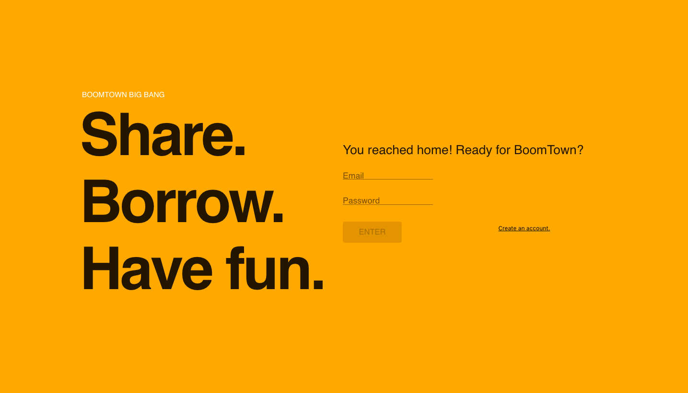
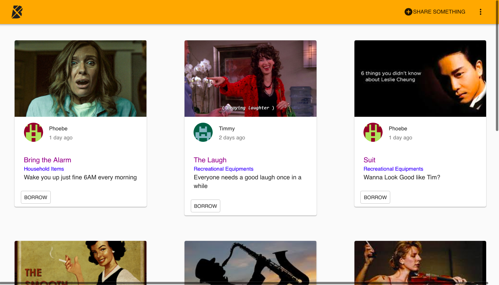

# Boomtown 🏙

Boomtown is a web app that you can go on to share items and borrow items as you please. On your profile page, you can see items that you have shared with others. As you upload your item, you can classify the items and add tags to your items so it is easy for people to understand. 

## Screenshots

### Welcome Page



### Main Item Page



## Technologies Used In This Project

Postgres

Apollo- Server & Client

Javascript- React and Redux Library

GraphQL

Node.JS/ NPM

Material UI Library

## Server

Commands must be run from the `server` directory:

### Installation

```bash
npm install
```

### Run

```bash
npm run start:dev
```

## Database

Database must be set up first before the project can be run as Apollo Queries would fetch data from the Database. Database can be set up with Postgres SQL. Four tables were set up for this project and the data could be displayed and edited on Postico: Items table, Users table, Tags table and ItemTags table (used to link the items with their corresponding tags).

## Client

Commands must be run from the `client` directory:

### Installation

```bash
npm install
```

### Run

```bash
npm start
```

### Build

```bash
npm run build
```

## Author

Created by : Tim Nguyen

## Credit

Red Academy Class Project Boomtown Boiler Plate

## Learning Lessons

Part 1- Back End Development

The project was informative as I learned how to create the Postgres database from scratch. I learned how to create Queries to fetch and insert items into the Postgres Database and test the Queries using GraphQL.

Part 2- Front End Development

This part of the project mainly focuses on rendering items on the user interface. The focus is on using Apollo Queries to get items and user profiles on their respective pages. The project also concerns on the use of Redux to link the Form and the Preview Component on Share Item Page.
